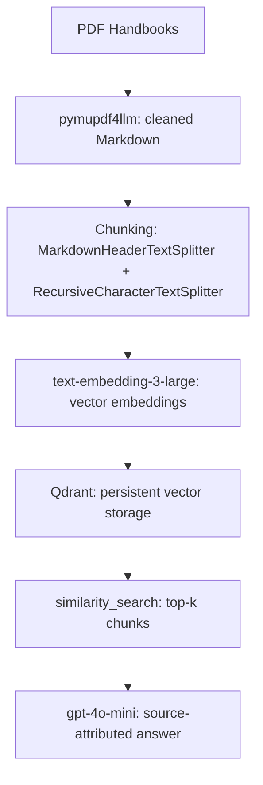

# PathFinder-Heinz
A retrieval-augmented generation (RAG) system that helps prospective students navigate Carnegie Mellon's Heinz College graduate programs. This program is built from official program handbooks, with source-attributed answers instead of generic chatbot responses.

**PathFinder@Heinz** is a rebuilt, more advanced version of an earlier project, **PathFinder@CISE**, which I originally built to help prospective students explore programs in the College of Integrated Science and Engineering (CISE) at James Madison University (JMU). This version uses a different, more sophisticated stack (Qdrant, Docker, OpenAI embeddings) and adds a rigorous evaluation layer. 

## Purpose of this tool
Years ago, when I was choosing my major in undergrad, course information and program descriptions were scattered and hard to navigate. This Inspired PathFinder@CISE, which has now evolved into PathFinder@Heinz. This program is meant to help prospective students who need help choosing between Heinz College's programs in an easier way rather than digging through dense, overlapping handbooks that don't make comparisons easy. PathFinder@Heinz retrieves the relevant sections across all the program handbooks and generates a direct, cited answer, rather than making a prospective student read multiple documents to find the information they seek.

## Tech Stack

### Data Extraction
- `pymupdf4llm` — converts program handbook PDFs into clean Markdown, preserving heading structure needed for accurate chunking

### Chunking
- `langchain-text-splitters` — `MarkdownHeaderTextSplitter` splits by section headers first, preserving document structure, then `RecursiveCharacterTextSplitter` breaks large sections into ~700-character chunks (30-character overlap)
- Every chunk is tagged with program metadata for source attribution

### Embedding
- `OpenAI text-embedding-3-large` (3072 dimensions) — chosen over the smaller text-embedding-3-small for stronger semantic separation between similarly-named programs (e.g., MISM vs. MISM-BIDA vs. MSIT vs. MSPPM-DA vs. MSPPM-DC)

### Vector storage
- `Qdrant Cloud` — client-server architecture

### Generation
- `gpt-4o-mini` — a smaller, cheaper model; Dynamic program detection (detect_program()) + Qdrant metadata filtering, so retrieval can narrow to the correct handbook(s) when a question names a specific program

### Evaluation
- `RAGAS — Faithfulness and Context Precision metrics, run against a 10-question, hand-verified test set with source-checked reference answers. 

## Project Pipeline

## Evaluation Findings 

| Question | Faithfulness | Context Precision | What it reveals |
|---|---|---|---|
| What is the difference between the msppm and the msppm-da programs? | 0.60 | 0.00 | Retrieval pulled a page-footer fragment + MSPPM-DC content instead of DA content. Answer stayed "faithful" to bad context — faithfulness alone hid this. |
| Does AIM have an internship requirement? | 0.00 | 0.50 | Correctly detected no AIM-specific internship evidence → honest "I don't know." Low faithfulness here is a metric artifact (zero claims made), not a real failure. |
| What extra core classes do I need for MISM BIDA compared to MISM? | 0.57 | 1.00 | Retrieval nailed it; any remaining answer imperfection is a generation-layer issue, not retrieval. |
| I am interested in managing and designing video games, which program should I choose? | 0.86 | 0.33 | Answer sounded great and stayed grounded, but retrieval only got ~2-3 of 5 chunks genuinely on-topic. Good example of faithfulness masking mediocre retrieval. |
| How is MSIT different from MISM? | 0.67 | 0.33 | Retrieval mixed real MSIT/MISM content with a header-only chunk and pure metadata lines — diluted precision despite a solid answer. |
| Can I take a gap year? | 0.20 | 0.00 | Expected — the real answer isn't in this corpus at all (deferred to a document I don't have). Correctly flagged as a known corpus gap, not a bug. |
| How do I take classes outside of Heinz college? | 0.67 | 1.00 | Retrieval excellent; matches grading note almost exactly. |
| I want to break into the health care industry, what should I pursue? | 0.60 | 0.75 | Solid on both counts; MSHCA content retrieved well, though didn't rank MSHCA as clearly primary in the final answer. |
| What is the weather like in Pittsburgh? | 0.00 | 0.00 | Correct refusal. Retrieved chunks matched only on the literal word "Pittsburgh" (library, campus) — good concrete proof that dense embeddings match words, not topical relevance. System stayed honest anyway. |
| What is the add drop deadline? | 1.00 | 1.00 | Clean, simple factual question — both metrics agree it's a strong result. |

**A key insight from this evaluation:** Individual metric scores can be misleading when read in isolation. Faithfulness and Context Precision measure different things, since a system can be "faithful" (consistent with what it retrieved) while retrieval itself pulled the wrong evidence entirely (resulting in a low context precision score). 

### Bugs found and fixed
- Cross-handbook retrieval confusion (AIM/MEIM) — fixed via detect_program() (LLM extracts named program from the question) + Qdrant metadata filtering in retrieve().
- Single-program filtering broke comparative questions — fixed by making detect_program() return a list and using Qdrant's should (OR) instead of must (AND) filter logic.
- LLM hallucinating a nonexistent metadata filename (inventing mism-bida-student-handbook, which doesn't exist — MISM and MISM-BIDA share one file) — fixed by hardcoding the real, closed list of filenames into the detect_program() prompt.

### Known, documented limitations
- Track-level confusion within a single handbook (e.g., MSPPM vs. MSPPM-DC, both in msppm-student-handbook) — program-level metadata can't distinguish sub-tracks sharing one file. A real fix would require finer-grained (track-level) chunk metadata and re-embedding.
- PDF table extraction artifacts — pymupdf4llm occasionally misreads a table's first data row as a header, or splits multi-line wrapped course titles into broken extra rows. A known, common limitation of PDF-to-Markdown conversion.
- Corpus gaps — some real answers (e.g., university-wide Leave of Absence policy) aren't in the ingested handbooks, since the source documents defer to external documents not included in this project.

## Roadmap
Outlined below are the tasks that have been completed in the roadmap as of 7/10/2026. As progress is made, the roadmap checklist will be updated accordingly.
- [x] PDF extraction and cleaning
- [x] Header-aware chunking with metadata
- [x] Embedding and vector storage
- [x] Retrieval + generation with source attribution
- [x] Evaluation dataset (9 questions, source-verified)
- [x] RAGAS scoring script and results
- [x] Deployment (Qdrant Cloud + functional Streamlit interface)
- [ ] **Current focus**: continuing to deepen evaluation methodology (additional metrics, larger test sets) and improve retrieval/generation quality
- [ ] Conversational memory

## Author
Built by **Shia Ananth**, M.S. Business Intelligence and Data Analytics student at Heinz College, Carnegie Mellon University, as a personal project to learn and improve knowledge on RAG systems. 
