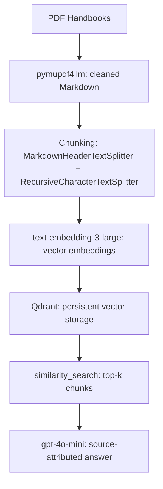

# PathFinder-Heinz
A retrieval-augmented generation (RAG) system that helps prospective students navigate Carnegie Mellon's Heinz College graduate programs — built from official program handbooks, with source-attributed answers instead of generic chatbot responses. PathFinder@Heinz is a 2.0 Version of PathFinder@CISE, a Retrieval-Augmented Generation (RAG) system designed to help prospective students explore programs in the College of Integrated Science and Engineering (CISE) at James Madison University (JMU). 

## Purpose of this tool
Choosing between Heinz College's programs means digging through dense, overlapping handbooks that don't make comparisons easy. PathFinder@Heinz retrieves the relevant sections across all the program handbooks and generates a direct, cited answer, rather than making a prospective student read multiple documents to find the information they seek.

## Tech Stack

## Project Pipeline

## Roadmap
Outlined below are the tasks that have been completed in the roadmap as of 7/10/2026. As progress is made, the roadmap checklist will be updated accordingly.
- [x] PDF extraction and cleaning
- [x] Header-aware chunking with metadata
- [x] Embedding and vector storage
- [x] Retrieval + generation with source attribution
- [x] Evaluation dataset (9 questions, source-verified)
- [ ] RAGAS scoring script and results
- [ ] Debugging based on evaluation findings
- [ ] Conversational memory
- [ ] Deployment (Qdrant Cloud + Streamlit, custom interface)

## Author
Built by **Shia Ananth**, M.S. Business Intelligence and Data Analytics student at Heinz College, Carnegie Mellon University, as a summer project to learn and improve knowledge on RAG systems. 
